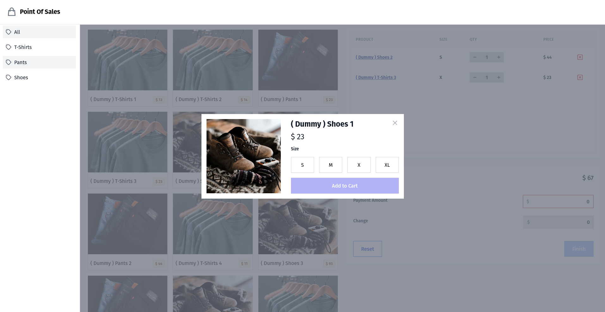

## Point Of Sales Application

#### data source  
> src/utils/data.js

#### running
``` 
cd react-tailwind-redux
npm i
npm run dev
```
 
#### screenshot


#### demo
https://react-tailwind-redux.vercel.app/